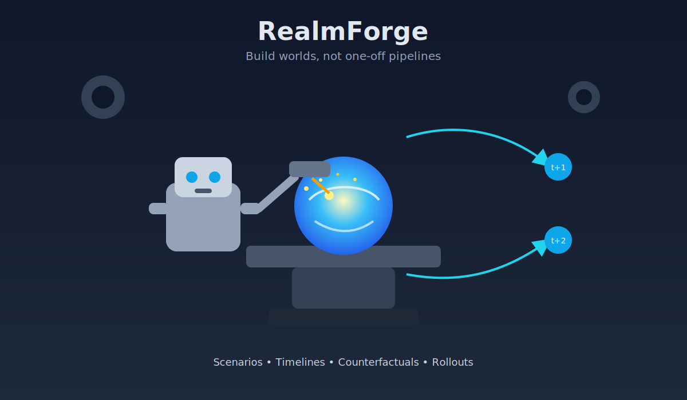

# RealmForge


Build worlds, not one-off pipelines.

<p align="center">
  
</p>

RealmForge is for teams who want to simulate decisions over time without rewriting infrastructure every time they switch realms. You bring the domain logic; RealmForge gives you a reusable backbone for state, actions, plausibility constraints, and rollouts.

In plain English:
- If you can describe your domain as "things changing over time"
- And you want to run "what if we do X instead of Y?"
- RealmForge helps you turn that into repeatable simulations.

## Why build on RealmForge?

Most simulation projects start fast and then get messy:
- domain code gets tightly coupled to model code
- experiments become hard to reproduce
- every new use-case needs custom plumbing

RealmForge keeps those concerns separated:
- a shared backbone in `app/wm_app/`
- domain overlays in `realms/`
- repeatable configs and quality gates for CI/CD

So your clinical, finance, logistics, or policy teams can all use the same engine with different "Realms."

## Naming and concepts

- RealmForge = the framework/repo
- Realm = a domain-specific scaffold (example: HealthRealm, FinanceRealm)
- World = the environment, entities, rules, and dynamics
- Campaign = a goal-driven journey/problem in that world
- Scenario = a concrete setup or counterfactual in a campaign
- Timeline / Run = one sampled rollout of what could happen

## Project structure

- `app/wm_app/` shared backbone (encoding, transition, energy, rollout interfaces)
- `realms/` realm overlays (schemas, mappings, concepts, actions)
- `configs/backbone/` default backbone configuration
- `.github/` CI/CD workflows, templates, and governance

## Quick start (simple)

```bash
python3 -m venv .venv
source .venv/bin/activate
pip install -e .[dev]
```

```bash
realm --build
realm --start
```

## Quick start (developer workflow)

```bash
pre-commit install
pre-commit run --all-files
make ci
pytest -q
```

## Examples

Start with the data-free hello world:

```bash
uv run python examples/hello-world/run.py
```

See `examples/hello-world/README.md` for details.

## Create a new Realm (boilerplate)

```bash
cp -R realms/_realm_template realms/<your_realm>
```

Then edit:
- `realms/<your_realm>/configs/domain.yaml`
- `realms/<your_realm>/mappings/schema.md`
- `realms/<your_realm>/pipelines/README.md`
- `realms/<your_realm>/concepts/seed_concepts.yaml`

Load merged config in Python:

```python
from app.wm_app.core.config_loader import load_domain_config

cfg = load_domain_config("realms/<your_realm>/configs/domain.yaml")
```

## Minimal realm modeling checklist

- define observed variables (`o_t`)
- define latent state (`z_t`) or proxies
- define actions (`a_t`)
- define outcomes (`y_t`)
- define plausibility factors/constraints (`E_i`)
- train: encoder -> JEPA -> transition -> energy -> outcomes
- simulate: campaign -> scenario -> timeline/run sampling

## Safety

Clinical realms are for retrospective research and medical education simulation only.
Do not present outputs as treatment recommendations.

## Heart Failure model continuation (start here)

To begin continuation for the HF model pipeline, run stages in order:

```bash
python -m app.data_build.build_cohort --config realms/clinical_hf/configs/domain.yaml
python -m app.features.build_dataset --config realms/clinical_hf/configs/domain.yaml
python -m app.encoders.train_encoder --config realms/clinical_hf/configs/domain.yaml
python -m app.jepa.train_jepa --config realms/clinical_hf/configs/domain.yaml
python -m app.transition.train_transition --config realms/clinical_hf/configs/domain.yaml
python -m app.energy_graph.train_energy --config realms/clinical_hf/configs/domain.yaml
```

Recommended continuation checklist:
- Rebuild cohort and feature parquet artifacts
- Resume JEPA/transition/energy training from latest artifacts
- Run evaluation + rollout sanity checks
- Run full quality gates before merging:

```bash
make ci
```

## License

MIT — see `LICENSE`.
